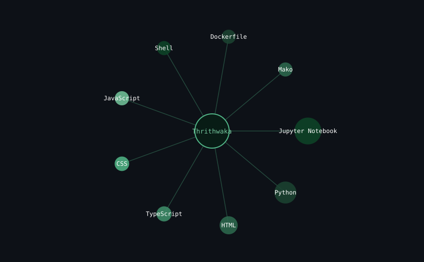

 

# Thrithwaka Preethi Shakya

**Data Science Researcher · AI / ML Engineer · Applied NLP**

 

&nbsp;&nbsp;

&nbsp;&nbsp;

 

## Research Focus

Final-year Data Science undergraduate at **SLTC Research University** (Sri Lanka Technological Campus), working at the intersection of NLP, deep learning, and human-centered computing — with a specific focus on low-resource language processing for **Sinhala and Singlish**.

| | |
|---|---|
| **Currently researching** | Emotionally adaptive AI companions, multilingual spam/toxicity detection, grounded LLM systems for public discourse analysis |
| **Methodology** | Full research pipelines — literature review, dataset schema design, model architecture, evaluation — built end-to-end on free-tier infrastructure |
| **Open to** | Research collaboration, AI/ML internships, open-source contribution in Data Science and applied deep learning |

 

## Technical Expertise

Computed from real per-repository language byte counts via the GitHub API — recalculated on every commit.

<!--START_SECTION:techstack-->
Not yet generated — runs on first workflow execution.
<!--END_SECTION:techstack-->

 

## Live Skill Graph

Node radius corresponds to each language's live share of code across all public repositories.

 

## Live Metrics

 

"Contributed to" reflects merged pull requests into repositories outside my own — the live measure of contribution to others' work.

 

## Featured Work

Every public, non-fork repository — sorted by most recent activity, sourced from the GitHub API.

<!--START_SECTION:projects-->
Not yet generated — runs on first workflow execution.
<!--END_SECTION:projects-->

 

## Recent Activity

<!--START_SECTION:activity-->
<!-- Populated automatically -- real recent commits, PRs, issues, and forks. -->
<!--END_SECTION:activity-->

 

  

Thrithwaka Preethi Shakya · Data Science, SLTC Research University

