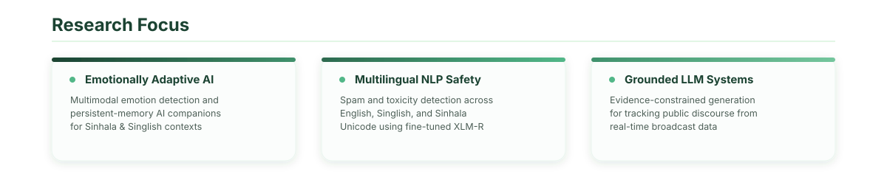
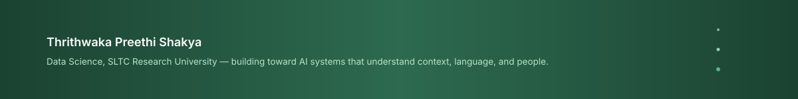

 

&nbsp;&nbsp;

&nbsp;&nbsp;

 

 

## Technical Expertise

Computed from real per-repository language byte counts via the GitHub API — recalculated on every commit.

<!--START_SECTION:techstack-->
<!-- Auto-generated from real per-repo language byte counts via the GitHub API. -->
| Language | Share | |
|---|---|---|
| **Jupyter Notebook** | 48.6% | `█████░░░░░` |
| **Python** | 30.1% | `███░░░░░░░` |
| **HTML** | 15.0% | `██░░░░░░░░` |
| **TypeScript** | 4.0% | `░░░░░░░░░░` |
| **CSS** | 1.6% | `░░░░░░░░░░` |
| **JavaScript** | 0.4% | `░░░░░░░░░░` |
| **Shell** | 0.2% | `░░░░░░░░░░` |
| **Dockerfile** | 0.0% | `░░░░░░░░░░` |
| **Mako** | 0.0% | `░░░░░░░░░░` |
| **TeX** | 0.0% | `░░░░░░░░░░` |
<!--END_SECTION:techstack-->

 

## Live Skill Graph

Node radius corresponds to each language's live share of code across all public repositories.

 

## Live Metrics

 

"Contributed to" reflects merged pull requests into repositories outside my own — the live measure of contribution to others' work.

 

## Featured Work

Every public, non-fork repository — sorted by most recent activity, sourced from the GitHub API.

<!--START_SECTION:projects-->
<!-- Auto-generated: every public, non-fork repo, sorted by most recently pushed. -->
| Project | Summary | Stack | Last Update |
|---|---|---|---|
| **[Thrithwaka](https://github.com/Thrithwaka/Thrithwaka)** | — | Python | 2026-09-04 |
| **[ogbn-arxiv-node-classification](https://github.com/Thrithwaka/ogbn-arxiv-node-classification)** | Node classification on the OGBN-Arxiv citation network using GCN and GraphSAGE, with model comparison, interpretability analysis, and an interactive dashboard. | Jupyter Notebook | 2026-09-03 |
| **[smartcare-ai-project](https://github.com/Thrithwaka/smartcare-ai-project)** | AI-powered disease risk classification system for SmartCare Hospital using ML, EDA, and Explainable AI (SHAP) — CCS3440 Artificial Intelligence coursework project. | Jupyter Notebook | 2026-08-16 |
| **[my-portfolio](https://github.com/Thrithwaka/my-portfolio)** | Professional portfolio website highlighting academic foundations, AI engineering projects, certifications, technical skills, and innovation-focused personal branding. | TypeScript | 2026-05-27 |
| **[LearnLens](https://github.com/Thrithwaka/LearnLens)** | AI-powered smart learning and quiz platform built with Flask, SQLAlchemy, and emotion-aware analytics to enhance digital education through interactive assessments, performance tracking, and intelligent engagement. | HTML | 2026-05-18 |
| **[motor_rul_prediction](https://github.com/Thrithwaka/motor_rul_prediction)** | AI-powered Motor Remaining Useful Life (RUL) Prediction System with real-time health monitoring, LSTM-based predictive maintenance, live sensor analytics, fault detection, and Flask dashboard integration for smart industrial condition monitoring. | HTML | 2026-05-18 |
| **[Wisec](https://github.com/Thrithwaka/Wisec)** | AI-powered Wi-Fi Security Vulnerability Assessment System that scans wireless networks, detects vulnerabilities, analyzes security risks, simulates passive threats, and provides intelligent security recommendations through Flask, machine learning, and cybersecurity automation. | Python | 2026-05-18 |
| **[CIT-23-02-0094](https://github.com/Thrithwaka/CIT-23-02-0094)** | — | Shell | 2025-08-24 |
<!--END_SECTION:projects-->

 

## Recent Activity

<!--START_SECTION:activity-->
1. 🎉 Merged PR [#5](https://github.com/ThilaniDilmani/public-pulse-srilanka/pull/5) in [ThilaniDilmani/public-pulse-srilanka](https://github.com/ThilaniDilmani/public-pulse-srilanka)
<!--END_SECTION:activity-->

 

